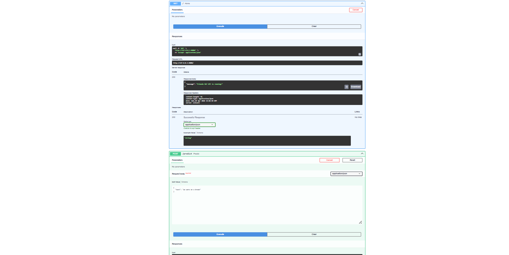
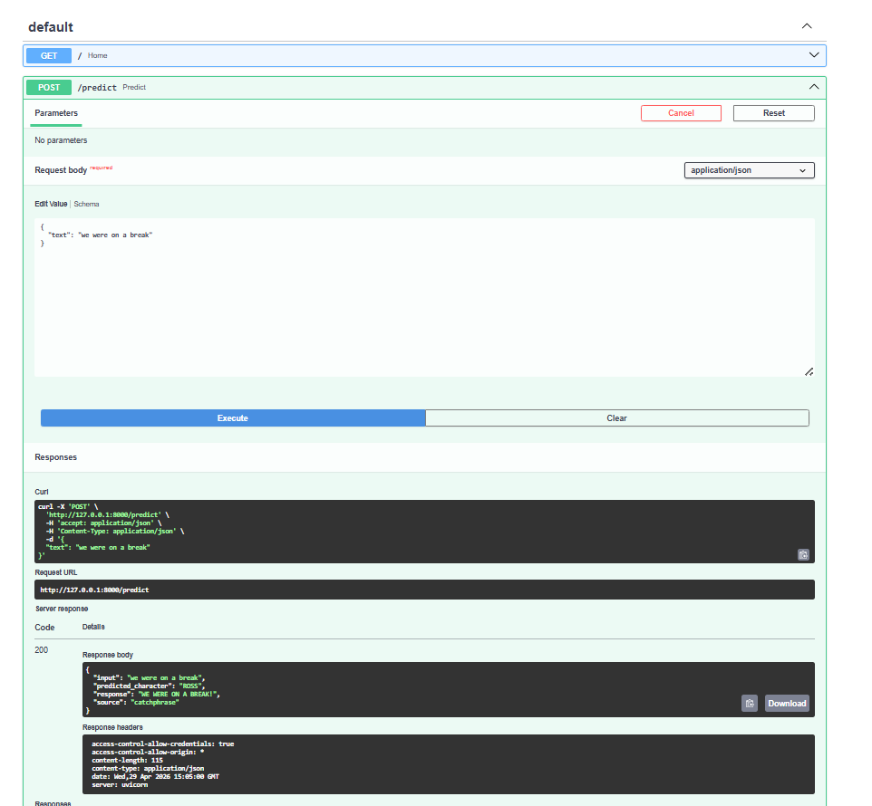

# Friends Catchphrase Detector (NLP Project)

## 📌 Overview
This project is a Natural Language Processing (NLP) application that detects and classifies character-specific catchphrases from the TV show *Friends*. It uses machine learning techniques to identify patterns in dialogue and predict which character a given line is most associated with.

## 🚀 Features
- Text preprocessing (tokenization, cleaning, normalization)
- TF-IDF vectorization for feature extraction
- Machine learning-based classification
- FastAPI backend for real-time predictions
- REST API endpoints for easy integration

## 🛠 Tech Stack
- Python
- scikit-learn
- Pandas, NumPy
- FastAPI
- NLP (TF-IDF Vectorization)

## 🔄 ML Pipeline

- Data Collection (Friends dialogue dataset)
- Text Preprocessing (cleaning, tokenization)
- Feature Extraction (TF-IDF vectorization)
- Model Training (classification model)
- Prediction via FastAPI API

## 🤖 Model Used
- TF-IDF Vectorizer
- Classification Model: (e.g., Logistic Regression / Naive Bayes)

## ⚙️ How It Works
1. Input dialogue text from the *Friends* dataset  
2. Preprocess the text (remove noise, tokenize, normalize)  
3. Convert text into numerical vectors using TF-IDF  
4. Feed vectors into a trained ML model  
5. Model predicts the character/catchphrase association  

## 🧪 Example Prediction

Input:
"We were on a break!"

Output:
Predicted Character: Ross

## 📸 API Preview

### Swagger Interface


### Example Prediction


## ▶️ How to Run

```bash
git clone https://github.com/alirida8852/friends-nlp-project
cd friends-nlp-project
pip install -r requirements.txt
uvicorn main:app --reload

## 💡 Motivation
This project was built to explore how NLP techniques can identify character-specific speech patterns in dialogue datasets.